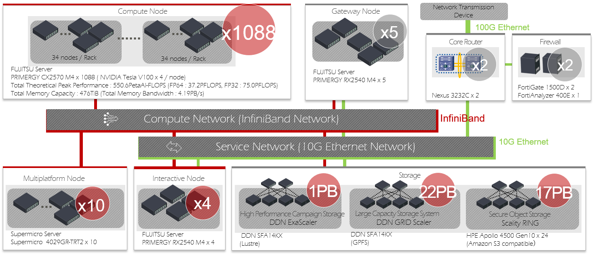

# 1. ABCI System Overview

## 1.1. System Architecture {#system-architecture}

AI Bridging Cloud Infrastructure, hereinafter referred to as "ABCI", is an open computing infrastructure for both developing AI technology and bridging AI technology into the industry and the real world. ABCI was fully operational in August 2018.

The ABCI system consists of 1,088 compute nodes with 4,352 NVIDIA V100 GPU accelerators and other computing resources, shared file systems and ABCI Cloud Storage with total capacity of approximately 40 PB, InfiniBand network that connects these elements at high speed, firewall, and so on. It also includes software to make the best use of these hardware. And, the ABCI system uses SINET5, the Science Information NETwork, to connect to the Internet at 100 Gbps.

The main specifications of the ABCI system are as follows:

| Item | Total Performance and Capacity |
|:--|:--|
| Theoretical Peak Performance (FP64) | 37.2 PFLOPS |
| Effective Performance by HPL | 19.88 PFLOPS[^1] |
| Effective Performance per Power by HPL | 14.423 GFLOPS/Watt |
| Theoretical Peak Performance (FP32) | 75.0 PFLOPS |
| Theoretical Peak Performance (FP16/FP32 mixed precision) | 550.6 PFLOPS |
| Theoretical Peak Performance (INT8) | 261.1 POPS |
| Total Memory Capacity | 476 TiB |
| Theoretical Peak Memory Bandwidth | 4.19 PB/s |
| Total Capacity of Local Storage | 1,740 TB |

[^1]: [https://www.top500.org/system/179393/](https://www.top500.org/system/179393/)

## 1.2 Computing Resources {#computing-resources}

Below is a list of the computational resources of the ABCI system.

| Node Type | Hostname | Description | # |
|:--|:--|:--|:--|
| Access Server | *as.abci.ai* | SSH server for external access | 2 |
| Interactive Node | *es* | Login server, the frontend of the ABCI system | 4 |
| Compute Node | *g0001*-*g1088* | Server w/ NVIDIA V100 GPU accelerators | 1,088 |
| Memory-Intensive Node | *m01*-*m10* | Server w/ Intel Optane memory | 10 |

!!! note
    Due to operational and maintenance reasons, some computing resources may not be provided.

Among them, the interactive node, the compute node, and the memory-intensive node are equipped with 2 ports of InfiniBand EDR, and they are connected by a fat tree by InfiniBand switch group together with the shared file systems and ABCI Cloud Storage described later.

Below are the details of these nodes.

### Interactive Node

The interactive node of ABCI system consists of FUJITSU Server PRIMERGY RX2540 M4.
The interactive node is equipped with two Intel Xeon Gold 6148 Processors and 384 GiB of main memory available.

The specifications of the interactive node are shown below:

| Item| Description | # |
|:--|:--|:--|
| CPU | [Intel Xeon Gold 6148 Processor 2.4 GHz, 20 Cores (40 Threads)](https://ark.intel.com/products/120489/Intel-Xeon-Gold-6148-Processor-27-5M-Cache-2-40-GHz-) | 2 |
| Memory | 32 GiB DDR4 2666 MHz RDIMM (ECC) | 12 |
| SSD | SAS-SSD 3.2 TB | 4 |
| Interconnect | InfiniBand EDR (100 Gbps) | 2 |
| | 10GBASE-SR | 2 |

Users can login to the interactive node, the frontend of the ABCI system, using SSH tunneling via the access server.

The interactive node allows users to interactively execute commands, and create and edit programs, submit jobs, and display job statuses. The interactive node does not have a GPU, but users can use it to develop programs for compute nodes.

Please refer to [ABCI System User Environment](02.md) for details of login method and [Job Execution Environment](03.md) for details of job submission method.

!!! warning
    Do not run high-load tasks on the interactive node, because resources such as CPU and memory of the interactive node are shared by many users. If you want to perform high-load pre-processing and post-processing, please the compute nodes.
	Please note that if you run a high-load task on the interactive node, the system will forcibly terminate it.

### Compute Node {#compute-node}

The compute node of ABCI system consists of FUJITSU Server PRIMERGY CX2570 M4.
The compute node is equipped with two Intel Xeon Gold 6148 Processors and four NVIDIA V100 GPU accelerators. In the entire system, the total number of CPU cores is 43,520 cores, and the total number of GPUs is 4,352.

The specifications of the compute node are shown below:

| Item | Description | # |
|:--|:--|:--|
| CPU | [Intel Xeon Gold 6148 Processor 2.4 GHz, 20 Cores (40 Threads)](https://ark.intel.com/products/120489/Intel-Xeon-Gold-6148-Processor-27-5M-Cache-2-40-GHz-) | 2 |
| GPU | [NVIDIA V100 for NVLink 16GiB HBM2](https://www.nvidia.com/en-us/data-center/v100/) | 4 |
| Memory | 32 GiB DDR4 2666 MHz RDIMM (ECC) | 12 |
| NVMe SSD | [Intel SSD DC P4600 1.6 TB u.2](https://ark.intel.com/products/97005/Intel-SSD-DC-P4600-Series-1-6TB-2-5in-PCIe-3-1-x4-3D1-TLC-) | 1 |
| Interconnect | InfiniBand EDR (100 Gbps) | 2 |

To execute the program for the compute node, submit the program to the job management system as a batch job or an interactive job. Interactive jobs allow you to compile and debug programs, and run interactive applications, visualization software and so on. For details, refer to [Job Execution Environment](03.md).

### Memory-Intensive Node {#memory-intensive-node}

The memory-intensive node of ABCI system consists of Supermicro 4029GR-TRT2.
The memory-intensive node is equipped with two Intel Xeon Gold 6132 Processors and two Intel Optane memory, and up to 2.6 TiB of memory can be used together with the main memory.

The specifications of the memory-intensive node are shown below:

| Item | Description | # |
|:--|:--|:--|
| CPU | [Intel Xeon Gold 6132 Processor 2.6 GHz, 14 Cores (28 Threads)](https://ark.intel.com/content/www/us/en/ark/products/123541/intel-xeon-gold-6    132-processor-19-25m-cache-2-60-ghz.html) | 2 |
| Memory | 32 GiB DDR4 2666 MHz RDIMM (ECC) | 24 |
| SSD | [Intel SSD DC S4500 1.9 TB](https://ark.intel.com/content/www/us/en/ark/products/120524/intel-ssd-dc-s4500-series-1-9tb-2-5in-sata-6gb-s-3d1-tlc.html) | 1 |
| Optane SSD | [Intel Optane SSD DC P4800X 1.5 TB](https://ark.intel.com/content/www/us/en/ark/products/187934/intel-optane-ssd-dc-p4800x-series-with-intel-memory-drive-technology-1-5tb-1-2-height-pcie-x4-3d-xpoint.html) | 2 |
| Interconnect | InfiniBand EDR (100 Gbps) | 2 |

To execute the program for the memory-intensive node, submit the program to the job management system as a batch job or an interactive job, as with the compute node.

## 1.3. Storage {#storage}

The ABCI system is equipped with the shared file systems and ABCI Cloud Storage for storing data used for Artificial Intelligence and Big Data applications. The total capacity is about 40 PB. Interactive nodes, compute nodes, and memory-intensive-nodes mount the shared file systems, and users can access these file systems from common mount points.

Below is a list of shared file systems and ABCI Cloud Storage that can be used with the ABCI system.

| Usage | Mount point | Capacity | File system | Notes |
|:--|:--|:--|:--|:--|
| Home area | /home | 1.0PB | Lustre | See [Home Area](04.md#home-area) |
| Group area 1 | /groups1 | 6.6PB | GPFS | See [Group Area](04.md#group-area) | 
| Group area 2 | /groups2 | 6.6PB | GPFS | See [Group Area](04.md#group-area) |
| Group area 3 | /groups3 | 6.6PB | GPFS | Reserved for special purposes |
| Application area | /apps | 335TB | GPFS | Area used by common software and data |
| ABCI Cloud Storage | | 17 PB max. | | See [ABCI Cloud Storage](abci-cloudstorage.md) |

Interactive nodes, compute nodes, and memory-intensive nodes each have local storage that can be used as a local scratch area. The list is shown below.

| Node type | Mount point | Capacity | File system | Notes |
|:--|:--|:--|:--|:--|
| Interactive node | /local | 12 TB | XFS | |
| Compute node | /local | 1.5 TB | XFS | See [Local Storage](04.md#local-storage) |
| memory-intensive node | /local | 1.8 TB | XFS | See [Local Storage](04.md#local-storage) |

## 1.4. Software {#software}

The software available on the ABCI system is shown below.

| Category | Software | Version |
|:--|:--|:--|
| OS | CentOS | 7.5 |
| Job Scheduler | Univa Grid Engine | 8.6.6 |
| Development Environment | Intel Parallel Studio XE Cluster Edition (compilers and libraries) | 2017 update 8 (2017.8.262) 2018 update 4 (2018.5.274) 2019 update 5 (2019.5.281) |
| | PGI Professional Edition | 17.10 18.10 19.1 19.10 20.1 |
| | [CUDA Toolkit](07.md#cuda-toolkit) | 8.0.61.2 9.0.176.4 9.1.85.3 9.2.88.1 9.2.148.1 10.0.130 10.0.130.1 10.1.243 10.2.89 |
| | GCC | 4.8.5 7.4.0 |
| | [Python](06.md) | 2.7.15 3.4.8 3.5.5 3.6.5 3.7.6 3.8.2 |
| | Ruby | 2.0.0.648-33 |
| | R | 3.5.0 3.6.3 |
| | Java | 1.7.0\_171 1.8.0\_242 11.0.6\_10 |
| | Scala | 2.12.6 |
| | Lua | 5.1.4 |
| | Perl | 5.16.3 |
| | Go | 1.12 1.13 |
| | Julia | 1.0 1.3 1.4 |
| File System | [DDN Lustre](04.md#home-area) | 2.10.7\_ddn14-1 |
| | [DDN GRIDScaler](04.md#group-area) | 4.2.3-20 |
| | [BeeOND](04.md#using-as-a-beeond-storage) | 7.1.5 |
| Object Storage | Scality S3 Connector | 7.4.5.4 |
| Container | [Docker](09.md#docker) | 17.12.0 |
| | [Singularity](09.md#singularity) | 2.6.1 |
| | [SingularityPRO](09.md#singularity) | 3.5 |
| MPI | [Open MPI](08.md#open-mpi) | 2.1.6 3.1.6 4.0.3 |
| | [MVAPICH2](08.md#mvapich2) | 2.3.3 2.3.4 |
| | [MVAPICH2-GDR](08.md#mvapich2-gdr) | 2.3.3 2.3.4 |
| | [Intel MPI](08.md#intel-mpi) | 2017.4 2018.4 2019.5 |
| Library | [cuDNN](07.md#cudnn) | 5.1.10 6.0.21 7.0.5 7.1.3 7.1.4 7.2.1 7.3.1 7.4.2 7.5.0 7.5.1 7.6.0 7.6.1 7.6.2 7.6.3 7.6.4 7.6.5 8.0.2 |
| | [NCCL](07.md#nccl) | 1.3.5-1 2.1.15-1 2.2.13-1 2.3.4-1 2.3.5-2 2.3.7-1 2.4.2-1 2.4.7-1 2.4.8-1 2.5.6-1 2.6.4-1 2.7.8-1 |
| | gdrcopy | 2.0 |
| | UCX | 1.7.0 |
| | libfabric | 1.7.0-1 |
| | Intel MKL | 2017.0.4 2018.0.4 2019.0.5 |
| Utility | aws-cli | 1.16.194 1.18 2.0 |
| | fuse-sshfs | 2.10 |
| | s3fs-fuse | 1.85 |
| | sregistry-cli | 0.2.31 |
| | Intel VTune | 2017.6 2018.4 2019.6 |
| | Intel Trace Analyzer and Collector | 2017.0.4 2018.0.4 2019.0.5 |
| | Intel Inspector | 2017.4 2018.4 2019.5 |
| | Intel Advisor | 2017.5 2018.4 2019.5 |
