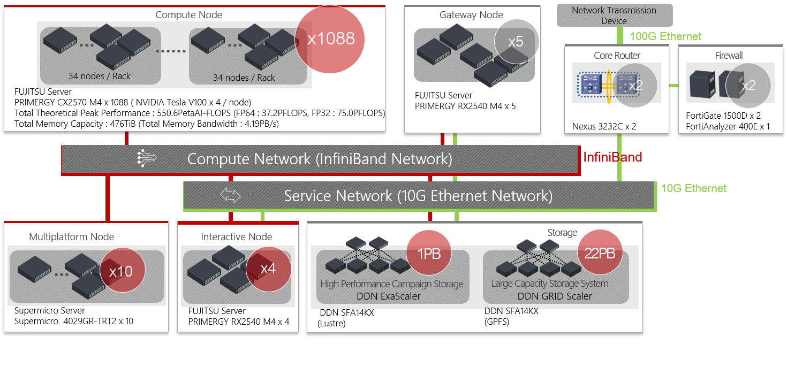

# 1. ABCI System Overview

## 1.1. System Architecture {#system-architecture}

This system is AI Bridging Cloud Infrastructure (ABCI).
The ABCI system consists of 1,088 compute nodes, large storage system which has 22PB disk space, high performance interconnect and software which makes the most of hardware.

The ABCI system provides total 16FP (half precision floating point) theoretical peak performance of 550PFLOPS and total 64FP (double precision floating point) theoretical peak performance of 37 PFLOPS. 
The total memory capacity is 476TiB, and total memory peak bandwidth is 4.19PB.

Each compute nodes and storage system are connected with InfiniBand EDR (100Gbps), and this system is connected to the Internet at speed of 100Gbps via SINET5.

## 1.2 Compute Resource Configuration {#compute-resource-configuration}
### 1.2.1 Compute Node {#compute-node-configuration}

The ABCI system comprises 1,088 nodes of FUJITSU Server PRIMERGY CX2570 M4.
Each compute node has two Intel Xeon Gold 6148 Processor (2.4 GHz, 20cores) and total number of cores is 43,520 cores.
In addition, each compute node has four NVIDIA GPU Tesla V100, and total number of GPU is 4,352 GPUs.

The specifications of the compute node are as follows.

| Item | Description | # |
|:--|:--|:--|
| CPU | [Intel Xeon Gold 6148 Processor 2.4 GHz, 20 Cores (40 Threads)](https://ark.intel.com/products/120489/Intel-Xeon-Gold-6148-Processor-27-5M-Cache-2-40-GHz-) | 2 |
| GPU | [NVIDIA Tesla V100 for NVLink 16GiB HBM2](https://www.nvidia.com/en-us/data-center/tesla-v100/) | 4 |
| Memory | 384 GiB DDR4 2666 MHz RDIMM (ECC) |
| SSD | [Intel SSD DC P4600 1.6 TB u.2](https://ark.intel.com/products/97005/Intel-SSD-DC-P4600-Series-1-6TB-2-5in-PCIe-3-1-x4-3D1-TLC-) | 1 |
| Interconnects | InfiniBand EDR (12.5 GB/s) | 2 |

### 1.2.2 Memory Intensive Node {#memory-intensive--node-configuration}

The ABCI system comprises 8 nodes of Supermicro 4029GR-TRT2.
Each memory intensive node has two Intel Xeon Gold 6132 Processor (2.6 GHz, 14cores) and total number of cores is 224 cores.
In addition, each memory intensive node has two Intel Optane SSD, and total amount of memory is 2.6 TiB.

The specifications of the memory intensive node are as follows.

| Item | Description | # |
|:--|:--|:--|
| CPU | [Intel Xeon Gold 6132 Processor 2.6 GHz, 14 Cores (28 Threads)](https://ark.intel.com/content/www/us/en/ark/products/123541/intel-xeon-gold-6    132-processor-19-25m-cache-2-60-ghz.html) | 2 |
| Memory | 768 GiB DDR4 2666 MHz RDIMM (ECC) |
| SSD | [IntelR SSD DC S4500 1.9 TB](https://ark.intel.com/content/www/us/en/ark/products/120524/intel-ssd-dc-s4500-series-1-9tb-2-5in-sata-6gb-s-3d1-tlc.html) | 1 |
| Optane memory| [Intel Optane SSD DC P4800X 1.5 TB ](https://ark.intel.com/content/www/us/en/ark/products/97155/intel-optane-ssd-dc-p4800x-series-1-5tb-2-5in-pcie-x4    -3d-xpoint.html) | 2 |
| Interconnects | InfiniBand EDR (12.5 GB/s) | 2 |

## 1.3. Software Configuration {#software-configuration}

The software available on the ABCI system is shown below.

| Category | Software | Version |
|:--|:--|:--|
| OS | CentOS | 7.5 |
| Job Scheduler | Univa Grid Engine | 8.6.6 |
| Development Environment | Intel Parallel Studio XE Cluster Edition (compilers and libraries) | 2017 update 8 (2017.8.262) 2018 update 4 (2018.5.274) 2019 update 5 (2019.5.281) |
| | PGI Professional Edition | 17.10 18.10 19.1 19.10 20.1 |
| | [CUDA Toolkit](07.md#cuda-toolkit) | 8.0.61.2 9.0.176.4 9.1.85.3 9.2.88.1 9.2.148.1 10.0.130 10.0.130.1 10.1.243 10.2.89 |
| | GCC | 4.8.5 7.4.0 |
| | [Python](06.md) | 2.7.15 3.4.8 3.5.5 3.6.5 3.7.6 3.8.2 |
| | Ruby | 2.0.0.648-33 |
| | R | 3.5.0 3.6.3 |
| | Java | 1.7.0\_171 1.8.0\_242 11.0.6\_10 |
| | Scala | 2.12.6 |
| | Lua | 5.1.4 |
| | Perl | 5.16.3 |
| | Go | 1.12 1.13 |
| | Julia | 1.0 1.3 1.4 |
| File System | [DDN Lustre](04.md#home-area) | 2.10.7\_ddn14-1 |
| | [DDN GRIDScaler](04.md#group-area) | 4.2.3-20 |
| | [BeeOND](04.md#using-as-a-beeond-storage) | 7.1.5 |
| Object Storage | Scality S3 Connector | 7.4.5.4 |
| Container | [Docker](09.md#docker) | 17.12.0 |
| | [Singularity](09.md#singularity) | 2.6.1 |
| MPI | [Open MPI](08.md#open-mpi) | 2.1.6 3.1.6 4.0.3 |
| | [MVAPICH2](08.md#mvapich2) | 2.3.3 2.3.4 |
| | [MVAPICH2-GDR](08.md#mvapich2-gdr) | 2.3.3 2.3.4 |
| | [Intel MPI](08.md#intel-mpi) | 2017.4 2018.4 2019.5 |
| Library | [cuDNN](07.md#cudnn) | 5.1.10 6.0.21 7.0.5 7.1.3 7.1.4 7.2.1 7.3.1 7.4.2 7.5.0 7.5.1 7.6.0 7.6.1 7.6.2 7.6.3 7.6.4 7.6.5 |
| | [NCCL](07.md#nccl) | 1.3.5-1 2.1.15-1 2.2.13-1 2.3.4-1 2.3.5-2 2.3.7-1 2.4.2-1 2.4.7-1 2.4.8-1 2.5.6-1 2.6.4-1 2.7.6-1 |
| | gdrcopy | 2.0 |
| | UCX | 1.7.0 |
| | libfabric | 1.7.0-1 |
| | Intel MKL | 2017.0.4 2018.0.4 2019.0.5 |
| Utility | aws-cli | 1.16.194 1.18 2.0 |
| | fuse-sshfs | 2.10 |
| | s3fs-fuse | 1.85 |
| | sregistry-cli | 0.2.31 |
| | Intel VTune | 2017.6 2018.4 2019.6 |
| | Intel Trace Analyzer and Collector | 2017.0.4 2018.0.4 2019.0.5 |
| | Intel Inspector | 2017.4 2018.4 2019.5 |
| | Intel Advisor | 2017.6 2018.4 2019.5 |

## 1.4. Storage Configuration {#storage-configuration}

The ABCI system has large capacity storage for storing the results of Artificial Intelligence and Big Data Analytics.
In addition, 1.6TB SSD is installed as local scratch in each compute node.
A list of each file system that can be used in the ABCI system is shown below.

| Usage | Mount point | Capacity | File system | Notes |
|:--|:--|:--|:--|:--|
| Home area | /home | 1.0PB | Lustre | |
| Group area 1 | /groups1 | 6.6PB | GPFS | | 
| Group area 2 | /groups2 | 6.6PB |  GPFS | |
| Application area | /apps | 335TB | GPFS | |
| Local scratch area for intaractive node | /local | 12TB/node | XFS | |
| Local scratch area for compute node | /local | 1.5TB/node | XFS | |

## 1.5. System Use Overview {#system-use-overview}

In the ABCI system, all compute nodes, interactive nodes share files through the parallel file system (DDN GRIDScaler).
All users can login to the interactive node as frontend with SSH tunneling.
After login to the interactive node, users can develop/compile/link a program, submit a job, display the status of the job and etc.
Users can develop a program for the compute node on the interactive node not equipped with GPUs.
To run a program on the compute nodes, users submit a batch job and an interactive job to job management system.
A interactive job is typically used for debugging a program, running an interactive application or a visualization application.

!!! warning
    Do not run high load tasks on the interactive node because computing resources such as CPU and memory of the interactive node are shared by many users. To run high load tasks for pre- & post-processing, use the compute nodes.
    Note that if you run high load tasks on the interactive node, the tasks will be forcibly terminated.
