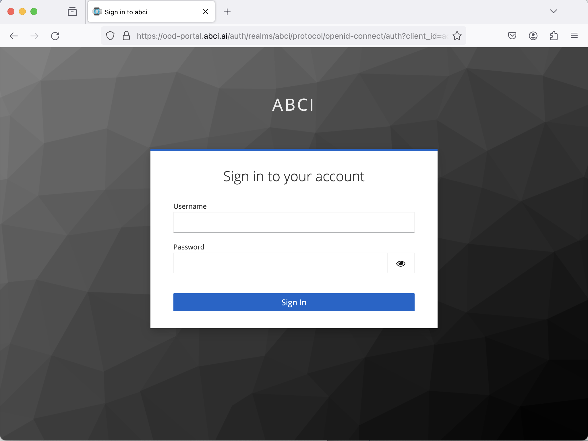

# Open OnDemand

## Overview

[Open OnDemand (OOD)](https://openondemand.org/) is a portal site for using ABCI through a web browser.

The following features become available on the web browser, making it easier to use ABCI than ever before:

* Console operations on interactive nodes
* File operations in the home areas and the group areas
* Use of web applications such as Jupyter Lab

!!! caution
    Open OnDemand is released as an experimental feature.
    The service may change without notice, and responses to inquiries may take some time.

## Login

To log in to the Open OnDemand, first open the URL [https://ood-portal.abci.ai/](https://ood-portal.abci.ai/).
After accessing `ood-portal.abci.ai`, you will be prompted to enter your username and password.
Please enter the username and password you set up on [the ABCI User Portal](https://portal.abci.ai/).

[{width=640}](img/login.png)

After authenticating with your username and password, you will be asked to enter an access code.
The access code will be sent to your registered email address, so please enter the access code into the input form after receiving it.

[{width=640}](img/email-otp.png)

After authenticating with the access code, you will be logged in to the Open OnDemand.

[{width=640}](img/ondemand-top-page.png)

!!! warning
    If an error occurs during login, please [contact](../contact.md) the administrator.

## Applications

You can access the features provided by the Open OnDemand from the menu at the top of the screen.

1. **Files**: Perform file operations in the browser.

2. **Jobs**: Edit and manage jobs in the browser.

3. **Clusters**: Open the console for the interactive nodes.

4. **Interactive Apps**: Launch web applications on the compute nodes and transfer the screen to the web browser. For details, please refer to [Interactive Apps](interactive-apps.md).

5. **AI Hub**: AI Hub is a collection of tools and services for reusing large-scale pre-trained models on the ABCI. It provides an application to manage the deployment of the Mlflow Tracking Server, one of the features that constitute AI Hub. For details, please refer to [AI Hub](aihub.md).
