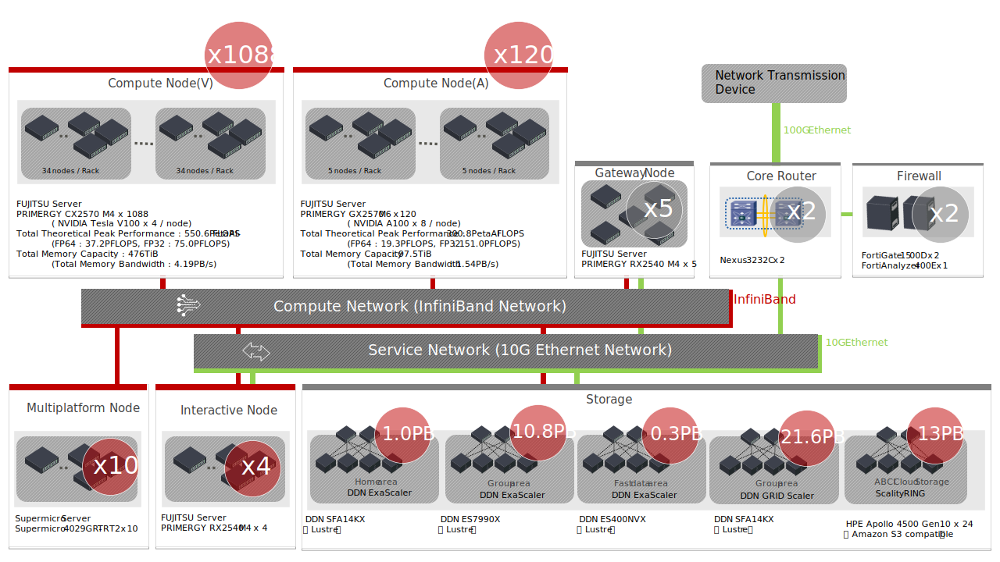

# ABCI System Overview

## System Architecture

The ABCI system consists of 1,088 compute nodes with 4,352 NVIDIA V100 GPU accelerators, 120 compute nodes with 960 NVIDIA A100 GPU accelerators and other computing resources, shared file systems and ABCI Cloud Storage with total capacity of approximately 24.6 PB, InfiniBand network that connects these elements at high speed, firewall, and so on. It also includes software to make the best use of these hardware. And, the ABCI system uses SINET5, the Science Information NETwork, to connect to the Internet at 100 Gbps.

!!! note
    The [Compute Node (V)](#compute-node-v) and [Compute Node (A)](#compute-node-a) services were discontinued on October 31, 2024.

The main specifications of the ABCI system are as follows:

| Item | Total Performance and Capacity: Compute Node (V) | Total Performance and Capacity: Compute Node (A) | Total Performance and Capacity |
|:--|:--|:--|:--|
| Theoretical Peak Performance (FP64) | 37.2 PFLOPS | 19.3 PFLOPS | 56.6 PFLOPS |
| Effective Performance by HPL | 19.88 PFLOPS[^1] | 11.48 PFLOPS | 22.20 PFLOPS[^2] |
| Effective Performance per Power by HPL | 14.423 GFLOPS/Watt | 21.89 GFLOPS/W | - |
| Theoretical Peak Performance (FP32) | 75.0 PFLOPS | 151.0 PFLOPS | 226.0 PFLOPS |
| Theoretical Peak Performance (FP16) | 550.6 PFLOPS | 300.8 PFLOPS | 851.5 PFLOPS |
| Theoretical Peak Performance (INT8) | 261.1 POPS | 599.0 POPS | 860.1 POPS |
| Total Memory Capacity | 476 TiB | 97.5 TiB | 573.5 TiB |
| Theoretical Peak Memory Bandwidth | 4.19 PB/s | 1.54 PB/s | 5.73 PB/s |
| Total Capacity of Local Storage | 1,740 TB | 480 TB | 2,220 TB |

[^1]: [https://www.top500.org/system/179393/](https://www.top500.org/system/179393/)
[^2]: [https://www.top500.org/system/179954/](https://www.top500.org/system/179954/)

## Computing Resources

Below is a list of the computational resources of the ABCI system.

| Node Type | Hostname | Description | # |
|:--|:--|:--|:--|
| Access Server | *as.abci.ai* | SSH server for external access | 2 |
| Interactive Node (V) | *es* | Login server for Compute Node (V), the frontend of the ABCI system | 2 |
| Interactive Node (A) | *es-a* | Login server for Compute Node (A), the frontend of the ABCI system | 2 |
| Compute Node (V) | *g0001*-*g1088* | Server w/ NVIDIA V100 GPU accelerators | 1,088 |
| Compute Node (A) | *a0001*-*a0120* | Server w/ NVIDIA A100 GPU accelerators | 120 |

!!! note
    In the following descriptions, `Interactive Node` refers to both the interactive node (V) and the interactive node (A).
    Similarly, `Compute Node` refers to both the compute node (V) and the compute node (A).

!!! note
    Due to operational and maintenance reasons, some computing resources may not be provided.

!!! note
    The memory-intensive node service ended at 15:00 on October 27, 2023.

Among them, interactive nodes, and compute nodes(V) are equipped with 2 ports of InfiniBand EDR, compute nodes(A) are equipped with 4 ports of InfiniBand HDR and they are connected by InfiniBand switch group together with [Storage Systems](#storage-systems) described later.

Below are the details of these nodes.

### Interactive Node

The ABCI system provides two types of compute nodes: compute node (V) and compute node (A). To improve the convenience of program development for each compute node, we provide two types of interactive nodes: interactive node (V) and interactive node (A).

When developing a program for each compute node application, use the corresponding interactive node. It is possible to submit jobs to both compute nodes from either interactive node.

The interactive node of ABCI system consists of FUJITSU Server PRIMERGY RX2540 M4.
The interactive node is equipped with two Intel Xeon Gold 6148 Processors and 384 GiB of main memory available.

The specifications of the interactive node are shown below:

| Item| Description | # |
|:--|:--|:--|
| CPU | [Intel Xeon Gold 6148 Processor 2.4 GHz, 20 Cores (40 Threads)](https://ark.intel.com/products/120489/Intel-Xeon-Gold-6148-Processor-27-5M-Cache-2-40-GHz-) | 2 |
| Memory | 32 GiB DDR4 2666 MHz RDIMM (ECC) | 12 |
| SSD | SAS-SSD 3.2 TB | 4 |
| Interconnect | InfiniBand EDR (100 Gbps) | 2 |
| | 10GBASE-SR | 2 |

Users can login to the interactive node, the frontend of the ABCI system, using SSH tunneling via the access server.

The interactive node allows users to interactively execute commands, and create and edit programs, submit jobs, and display job statuses. The interactive node does not have a GPU, but users can use it to develop programs for compute nodes.

Please refer to [Getting Started ABCI](getting-started.md) for details of login method and [Job Execution](job-execution.md) for details of job submission method.

!!! warning
    Do not run high-load tasks on the interactive node, because resources such as CPU and memory of the interactive node are shared by many users. If you want to perform high-load pre-processing and post-processing, please the compute nodes.
	Please note that if you run a high-load task on the interactive node, the system will forcibly terminate it.

### Compute Node

The compute node in an ABCI system consists of a compute node (V) and a compute node (A).
To execute the program for the compute node, submit the program to the job management system as a batch job or an interactive job. Interactive jobs allow you to compile and debug programs, and run interactive applications, visualization software and so on. For details, refer to [Job Execution](job-execution.md).

#### Compute Node (V)

The compute node (V) of ABCI system consists of FUJITSU Server PRIMERGY CX2570 M4.
The compute node (V) is equipped with two Intel Xeon Gold 6148 Processors and four NVIDIA V100 GPU accelerators. In the entire system, the total number of CPU cores is 43,520 cores, and the total number of GPUs is 4,352.

The specifications of the compute node (V) are shown below:

| Item | Description | # |
|:--|:--|:--|
| CPU | [Intel Xeon Gold 6148 Processor 2.4 GHz, 20 Cores (40 Threads)](https://ark.intel.com/products/120489/Intel-Xeon-Gold-6148-Processor-27-5M-Cache-2-40-GHz-) | 2 |
| GPU | [NVIDIA V100 for NVLink 16GiB HBM2](https://www.nvidia.com/en-us/data-center/v100/) | 4 |
| Memory | 32 GiB DDR4 2666 MHz RDIMM (ECC) | 12 |
| NVMe SSD | [Intel SSD DC P4600 1.6 TB u.2](https://ark.intel.com/products/97005/Intel-SSD-DC-P4600-Series-1-6TB-2-5in-PCIe-3-1-x4-3D1-TLC-) | 1 |
| Interconnect | InfiniBand EDR (100 Gbps) | 2 |

Reference: [Block Diagram of Compute Node (V)](img/compute-node-v-diagram.png)

#### Compute Node (A)

The compute node (A) of ABCI system consists of FUJITSU Server PRIMERGY GX2570 successor.
The compute node (A) is equipped with two Intel Xeon Platinum 8360Y Processors and eight NVIDIA A100 GPU accelerators. In the entire system, the total number of CPU cores is 8,640 cores, and the total number of GPUs is 960.

The specifications of the compute node (A) are shown below:

| Item | Description | # |
|:--|:--|:--|
| CPU | [Intel Xeon Platinum 8360Y Processor 2.4 GHz, 36 Cores (72 Threads)](https://ark.intel.com/content/www/us/en/ark/products/212459/intel-xeon-platinum-8360y-processor-54m-cache-2-40-ghz.html) | 2 |
| GPU | [NVIDIA A100 for NVLink 40GiB HBM2](https://www.nvidia.com/en-us/data-center/a100/) | 8 |
| Memory | 32 GiB DDR4 3200 MHz RDIMM (ECC) | 16 |
| NVMe SSD | [Intel SSD DC P4510 2.0 TB u.2](https://ark.intel.com/content/www/us/en/ark/products/122580/intel-ssd-dc-p4510-series-2-0tb-2-5in-pcie-3-1-x4-3d2-tlc.html) | 2 |
| Interconnect | InfiniBand HDR (200 Gbps) | 4 |

Reference: [Block Diagram of Compute Node (A)](img/compute-node-a-diagram.png)

## Storage Systems

The ABCI system has four storage systems for storing large amounts of data used for AI and Big Data applications, and these are used to provide shared file systems and ABCI Cloud Storage. The total effective capacity is up to 24.6 PB.

| # | Storage System | Media | Usage |
|:--|:--|:--|:--|
| 1 | DDN ES400NVX2 x1 | 30.72 TB NVMe SSD x24 | Home area(/home), Application area |
| 2 | DDN ES7990X x3 DDN SS9012 Enclosure x6 | 18 TB NL-SAS HDD x801 | Group area(/groups) |
| 3 | DDN ES400NVX x3 | 7.68 TB NVMe HDD x69 | Fast data area(/bb) |
| 4 | HPE Apollo 4510 Gen10 x24 | 12 TB SATA HDD x1440 | ABCI Cloud Storage |

Below is a list of shared file systems and ABCI Cloud Storage provided by the ABCI system using the above storage systems.

| Usage | Mount point | Capacity | File system | Notes |
|:--|:--|:--|:--|:--|
| Home area | /home | 0.5 PB | Lustre | See [Home Area](storage.md#home-area) |
| Group area | /groups | 10.8 PB | Lustre | See [Group Area](storage.md#group-area) |
| ABCI Cloud Storage | | 13 PB max. | | See [ABCI Cloud Storage](abci-cloudstorage.md) |
| Fast data area | /bb | 0.3 PB | | Reserved area for the particular application |
| Global scratch area | /scratch | 0.1 PB (physically included in /bb) | Lustre | See [Global scratch area](storage.md#scratch-area) |

Interactive nodes, and compute nodes mount the shared file systems, and users can access these file systems from common mount points.

Besides this, these nodes each have local storage that can be used as a local scratch area. The list is shown below.

| Node type | Mount point | Capacity | File system | Notes |
|:--|:--|:--|:--|:--|
| Interactive node | /local | 12 TB | XFS | |
| Compute node (V) | /local | 1.6 TB | XFS | See [Local Storage](storage.md#local-storage) |
| Compute node (A) | /local1 | 2.0 TB | XFS | See [Local Storage](storage.md#local-storage) |
|                 | /local2 | 2.0 TB | XFS | See [Local Storage](storage.md#local-storage) |

## Software

The software available on the ABCI system is shown below.

| Category | Software | Interactive/Compute Node (V) Version | Interactive/Compute Node (A) Version |
|:--|:--|:--|:--|
| OS | Rocky Linux | 8.6 | - |
| OS | Red Hat Enterprise Linux | - | 8.2 |
| Job Scheduler | Altair Grid Engine | 8.6.19_C121_1 | 8.6.19_C121_1 |
| Development Environment | [CUDA Toolkit](gpu.md#cuda-toolkit) | 11.2.2 11.6.2 11.7.1 11.8.0 12.1.1 12.2.0 12.3.2 12.4.0 12.4.1 12.5.0 12.5.1 12.6.1 | 11.2.2 11.6.2 11.7.1 11.8.0 12.1.1 12.2.0 12.3.2 12.4.0 12.4.1 12.5.0 12.5.1 12.6.1 |
| | Intel oneAPI (compilers and libraries) | 2024.0.2 | 2024.0.2 |
| | Intel VTune | 2024.0.0 | 2024.0.0 |
| | Intel Trace Analyzer and Collector | 2022.0 | 2022.0 |
| | Intel Inspector | 2024.0 | 2024.0 |
| | Intel Advisor | 2024.0.0 | 2024.0.0 |
| | GCC | 8.5.0 13.2.0 | 8.3.1 13.2.0 |
| | cmake | 3.29.0 | 3.29.0 |
| | [Python](python.md) | 3.10.14 3.11.9 3.12.2 | 3.10.14 3.11.9 3.12.2 |
| | Ruby | 2.5.9-229 | 2.5.5-157 |
| | R | 4.3.3 | 4.3.3 |
| | Java | 1.8.0.422 11.0.24.0.8 17.0.12.0.7 | 1.8.0.422 11.0.24.0.8 17.0.12.0.7 |
| | Scala | 2.10.6 | 2.10.6 |
| | Perl | 5.26.3 | 5.26.3 |
| | Go | 1.22.2 | 1.22.2 |
| | Julia | 1.10 | 1.10 |
| File System | [DDN Lustre](storage.md#home-area) | 2.14.0\_ddn134 | 2.14.0\_ddn134 |
| | [BeeOND](storage.md#beeond-storage) | 7.3.3 | 7.3.3 |
| Object Storage | Scality S3 Connector | 7.10.6.7 | 7.10.6.7 |
| Container | [SingularityPRO](containers.md#singularity) | 4.1.2-2 | 4.1.2-2 |
| | Singularity Endpoint | 2.3.0 | 2.3.0 |
| MPI | [Intel MPI](mpi.md#intel-mpi) | 2021.11 | 2021.11 |
| Library | [cuDNN](gpu.md#cudnn) | 8.1.1 8.3.3 8.4.1 8.6.0 8.7.0 8.8.1 8.9.7 9.0.0 9.1.1 9.2.1 9.3.0 9.4.0 | 8.1.1 8.3.3 8.4.1 8.6.0 8.7.0 8.8.1 8.9.7 9.0.0 9.1.1 9.2.1 9.3.0 9.4.0 |
| | [NCCL](gpu.md#nccl) | 2.8.4-1 2.11.4-1 2.12.12-1 2.13.4-1 2.14.3-1 2.15.5-1 2.16.2-1 2.17.1-1 2.18.5-1 2.19.3-1 2.20.5-1 2.21.5-1 2.22.3-1 | 2.8.4-1 2.11.4-1 2.12.12-1 2.13.4-1 2.14.3-1 2.15.5-1 2.16.2-1 2.17.1-1 2.18.5-1 2.19.3-1 2.20.5-1 2.21.5-1 2.22.3-1 |
| | gdrcopy | 2.4.1 | 2.4.1 |
| | UCX | 1.10 | 1.11 |
| | libfabric | 1.7.0-1 | 1.9.0rc1-1 |
| | Intel MKL | 2024.0.0 | 2024.0.0 |
| Utility | aws-cli | 2.15.35 | 2.15.35 |
| | s3fs-fuse | 1.94 | 1.94 |
| | rclone | 1.61.1 | 1.61.1 |

