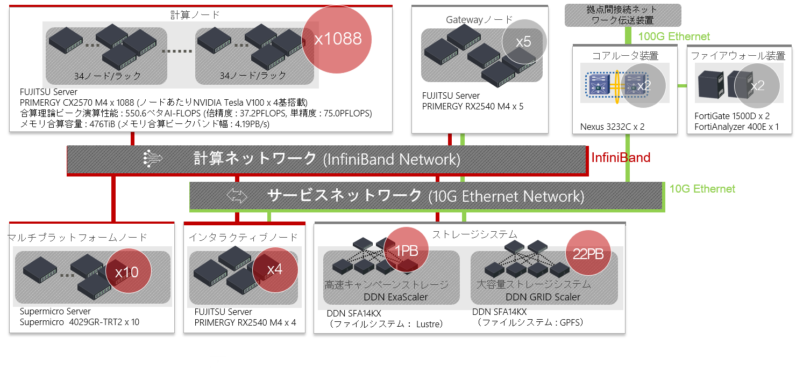

# 1. ABCIシステムの概要

## システム全体概要 {#system-architecture}

ABCIシステムは、合計4,352基のNVIDIA V100 GPUアクセラレーターを備えた1,088台の計算ノードを始めとする計算リソース、合算で約47 PBの容量を有する共有ファイルシステム及びABCIクラウドストレージ、これらを高速に結合するInfiniBandネットワーク、ファイアウォールなどからなるハードウェアと、これらを最大限活用するためのソフトウェアから構成されます。また、ABCIシステムは学術情報ネットワークSINET5を利用して、100 Gbpsでインターネットに接続しています。

 

ABCIシステムの主要な諸元は以下のとおりです。

| 項目 | 合算性能・容量 |
|:--|:--|
| 理論ピーク演算性能 (FP64) | 37.2 PFLOPS |
| HPLによる実効性能 | 19.88 PFLOPS[^1] |
| HPLによる電力あたりの実効性能 | 14.423 GFLOPS/Watt |
| 理論ピーク演算性能 (FP32) | 75.0 PFLOPS |
| 理論ピーク演算性能 (FP16/FP32混合精度) | 550.6 PFLOPS |
| 理論ピーク演算性能 (INT8) | 261.1 POPS |
| メモリ合算容量 | 476 TiB |
| メモリ合算ピークバンド幅 | 4.19 PB/s |
| ローカルストレージの合算容量 | 1,740 TB |

[^1]: [https://www.top500.org/system/179393/](https://www.top500.org/system/179393/)

## 計算リソース {#computing-resources}

ABCIシステムの計算リソースの一覧を以下に示します。

| 項目 | ホスト名 | 説明 | ノード数 |
|:--|:--|:--|:--|
| アクセスサーバ | *as.abci.ai* | 外部からアクセスするためのSSHサーバ | 2 |
| インタラクティブノード | *es* | ABCIシステムのフロントエンドとなるログインサーバ | 4 |
| 計算ノード | *g0001*-*g1088* | NVIDIA V100 GPUを搭載するサーバ | 1,088 |
| メモリインテンシブノード | *m01*-*m10* | Intel Optaneメモリを搭載するサーバ | 10 |

!!! note
    運用・保守上の合理的理由により、計算リソースの一部が提供されない場合があります。

このうち、インタラクティブノード、計算ノード、メモリインテンシブノードはInfiniBand EDRを2ポート備えており、後述の[ストレージシステム](#storage-systems)とともに、InfiniBandスイッチによりファットツリーで接続されます。

以下ではこれらのノードの詳細を以下に示します。

### インタラクティブノード {#interactive-node}

ABCIシステムのインタラクティブノードは、FUJITSU Server PRIMERGY RX2540 M4で構成されています。
Intel Xeon Gold 6148プロセッサーを2基搭載し、384 GiBのメインメモリが利用可能です。

インタラクティブノードの構成を以下に示します。

| 項目 | 説明 | 個数 |
|:--|:--|:--|
| CPU | [Intel Xeon Gold 6148プロセッサー 2.4 GHz, 20 Cores (40 Threads)](https://ark.intel.com/products/120489/Intel-Xeon-Gold-6148-Processor-27-5M-Cache-2-40-GHz-) | 2 |
| Memory | 32 GiB DDR4 2666 MHz RDIMM (ECC) | 12 |
| SSD | SAS-SSD 3.2 TB | 4 |
| Interconnect | InfiniBand EDR (100 Gbps) | 2 |
| | 10GBASE-SR | 2 |

ABCIシステムのフロントエンドであるインタラクティブノードには、アクセスサーバを経由したSSHトンネリングを用いてログインします。インタラクティブノードではコマンドの対話的実行が可能であり、プログラムの作成・編集、ジョブ投入・表示などを行います。インタラクティブノードにはGPUが搭載されていませんが、インタラクティブノードで計算ノード向けのプログラム開発も可能です。

ログイン方法の詳細は[ABCIシステム利用環境](02.md)、ジョブ投入方法の詳細は[ジョブ実行環境](03.md)をそれぞれ参照してください。

!!! warning
    インタラクティブノードのCPUやメモリなどの資源は多くの利用者で共有するため、高負荷な処理は行わないようにしてください。高負荷な前処理、後処理を行う場合は、計算ノードを利用してください。
    インタラクティブノードで高負荷な処理を行った場合、システムにより処理が強制終了されますのでご注意ください。

### 計算ノード {#compute-node}

ABCIシステムの計算ノードは、FUJITSU Server PRIMERGY CX2570 M4で構成されています。
計算ノードは、Intel Xeon Gold 6148プロセッサーを2基、NVIDIA V100 GPUアクセラレーターを4基搭載しています。システム全体では、総CPUコア数は43,520コア、総GPU数は4,352基となります。

計算ノードの構成を以下に示します。

| 項目 | 説明 | 個数 |
|:--|:--|:--|
| CPU | [Intel Xeon Gold 6148プロセッサー 2.4 GHz, 20 Cores (40 Threads)](https://ark.intel.com/products/120489/Intel-Xeon-Gold-6148-Processor-27-5M-Cache-2-40-GHz-) | 2 |
| GPU | [NVIDIA V100 for NVLink 16GiB HBM2](https://www.nvidia.com/en-us/data-center/v100/) | 4 |
| Memory | 32 GiB DDR4 2666 MHz RDIMM (ECC) | 12 |
| NVMe SSD | [Intel SSD DC P4600 1.6 TB u.2](https://ark.intel.com/products/97005/Intel-SSD-DC-P4600-Series-1-6TB-2-5in-PCIe-3-1-x4-3D1-TLC-) | 1 |
| Interconnect | InfiniBand EDR (100 Gbps) | 2 |

計算ノード向けのプログラムを実行するには、バッチジョブもしくはインタラクティブジョブとしてジョブ管理システムに処理を依頼します。インタラクティブジョブでは、プログラムのコンパイルやデバッグ、対話的なアプリケーション、可視化ソフトウェアの実行が可能です。詳細は[ジョブ実行環境](03.md)を参照してください。

### メモリインテンシブノード {#memory-intensive-node}

ABCIシステムのメモリインテンシブノードは、Supermicro 4029GR-TRT2で構成されています。
メモリインテンシブノードは、Intel Xeon Gold 6132プロセッサーを2基、Intel Optane メモリを2基搭載し、メインメモリと合わせて最大2.6 TiBのメモリを利用可能です。

メモリインテンシブノードの構成を以下に示します。

| 項目 | 説明 | 個数 |
|:--|:--|:--|
| CPU | [Intel Xeon Gold 6132プロセッサー 2.6 GHz, 14 Cores (28 Threads)](https://ark.intel.com/content/www/us/en/ark/products/123541/intel-xeon-gold-6132-processor-19-25m-cache-2-60-ghz.html) | 2 |
| Memory | 32 GiB DDR4 2666 MHz RDIMM (ECC) | 24 |
| SSD | [Intel SSD DC S4500 1.9 TB](https://ark.intel.com/content/www/us/en/ark/products/120524/intel-ssd-dc-s4500-series-1-9tb-2-5in-sata-6gb-s-3d1-tlc.html) | 1 |
| Optane SSD | [Intel Optane SSD DC P4800X 1.5 TB](https://ark.intel.com/content/www/us/en/ark/products/187934/intel-optane-ssd-dc-p4800x-series-with-intel-memory-drive-technology-1-5tb-1-2-height-pcie-x4-3d-xpoint.html) | 2 |
| Interconnect | InfiniBand EDR (100 Gbps) | 2 |

メモリインテンシブノード向けのプログラムを実行するには、計算ノードと同様に、バッチジョブもしくはインタラクティブジョブとしてジョブ管理システムに処理を依頼します。

## ストレージシステム {#storage-systems}

ABCIシステムは、人工知能やビッグデータ応用に用いる大容量データを格納するためのストレージシステムを5基備えており、これらを用いて共有ファイルシステム及びABCIクラウドストレージを提供しています。合算で最大47 PBの実効容量があります。

| 構成 | ストレージシステム | メディア | 用途 |
|:--|:--|:--|:--|
| 1 | DDN SFA 14KX x1 DDN SS9012エンクロージャ x5 | 7.68 TB SAS SSD x185 | ホーム領域、アプリケーション領域 |
| 2 | DDN ES7990X x3 DDN SS9012エンクロージャ x6 | 18 TB NL-SAS HDD x801 | グループ領域 |
| 3 | DDN NV400NVX x3 | 7.68 TB NVMe HDD x69 | 高速データ領域 |
| 4 | DDN SFA 14KX x3 DDN SS8462エンクロージャ x30 | 3.84 TB SAS SSD x216 12 TB NL-SAS HDD x2400 | グループ領域 |
| 5 | HPE Apollo 4510 Gen10 x24 | 12 TB SATA HDD x1440 | ABCIクラウドストレージ |

上記のストレージシステムを用いて、ABCIシステムが提供している共有ファイルシステム及びABCIクラウドストレージの一覧を以下に示します。

| 用途 | マウントポイント | 容量 | ファイルシステム | 備考 |
|:--|:--|:--|:--|:--|
| ホーム領域 | /home | 1.0 PB | Lustre | [ホーム領域](04.md#home-area)を参照 |
| グループ領域 | /groups | 10.8PB | Lustre | [グループ領域](04.md#group-area)を参照 |
| グループ領域1 | /fs1 | 7.2 PB | GPFS | [グループ領域](04.md#group-area)を参照 |
| グループ領域2 | /fs2 | 7.2 PB | GPFS | [グループ領域](04.md#group-area)を参照 |
| グループ領域3 | /fs3 | 7.2 PB | GPFS | 特定用途に予約済みの領域 |
| ABCIクラウドストレージ | | 最大13 PB | | [ABCIクラウドストレージ](abci-cloudstorage.md)を参照 |

インタラクティブノード、計算ノード、メモリインテンシブノードは、共有ファイルシステムをマウントしており、利用者は共通のマウントポイントからこれらのファイルシステムにアクセスすることができます。

これ以外に、これらのノードはそれぞれローカルスクラッチ領域として利用可能なローカルストレージを搭載しています。以下に一覧を示します。

| ノード種類 | マウントポイント | 容量 | ファイルシステム | 備考 |
|:--|:--|:--|:--|:--|
| インタラクティブノード | /local | 12 TB | XFS | |
| 計算ノード | /local | 1.6 TB | XFS | [ローカルストレージ](04.md#local-storage)を参照 |
| メモリインテンシブノード | /local | 1.9 TB | XFS | [ローカルストレージ](04.md#local-storage)を参照 |

## ソフトウェア {#software}

ABCIシステムで利用可能なソフトウェア一覧を以下に示します。

| Category | Software | Version |
|:--|:--|:--|
| OS | CentOS | 7.5 |
| Job Scheduler | Univa Grid Engine | 8.6.17 |
| Development Environment | Intel Parallel Studio XE Cluster Edition (compilers and libraries) | 2020 update 4 (2020.4.304) |
| | PGI Professional Edition | 20.4 |
| | NVIDIA HPC SDK | 20.11 21.2 |
| | [CUDA Toolkit](07.md#cuda-toolkit) | 8.0.61.2 9.0.176.4 9.1.85.3 9.2.88.1 9.2.148.1 10.0.130.1 10.1.243 10.2.89 11.0.3 11.1.1 11.2.2 |
| | GCC | 4.8.5 7.4.0 9.3.0 |
| | [Python](06.md) | 2.7.18 3.6.12 3.7.X 3.8.7 |
| | Ruby | 2.0.0.648-33 |
| | R | 4.0.4 |
| | Java | 1.7.0\_171 1.8.0\_242 11.0.6\_10 |
| | Scala | 2.12.6 |
| | Lua | 5.1.4 |
| | Perl | 5.16.3 |
| | Go | 1.14 1.15 |
| | Julia | 1.0 1.5 |
| File System | [DDN Lustre](04.md#home-area) | 2.12.6\_ddn13-1 |
| | [DDN GRIDScaler](04.md#group-area) | 4.2.3-20 |
| | [BeeOND](04.md#using-as-a-beeond-storage) | 7.2.1 |
| Object Storage | Scality S3 Connector | 7.4.8.1 |
| Container | [Docker](09.md#docker) | 19.03.15 |
| | [SingularityPRO](09.md#singularity) | 3.7-1 |
| MPI | [Open MPI](08.md#open-mpi) | 2.1.6 3.1.6 4.0.5 |
| | [MVAPICH2](08.md#mvapich2) | 2.3.5 |
| | [MVAPICH2-GDR](08.md#mvapich2-gdr) | 2.3.5 |
| | [Intel MPI](08.md#intel-mpi) | 2019.9 |
| Library | [cuDNN](07.md#cudnn) | 5.1.10 6.0.21 7.0.5 7.1.4 7.2.1 7.3.1 7.4.2 7.5.1 7.6.5 8.0.5 8.1.1 |
| | [NCCL](07.md#nccl) | 1.3.5-1 2.1.15-1 2.2.13-1 2.3.7-1 2.4.8-1 2.5.6-1 2.6.4-1 2.7.8-1 2.8.4-1 |
| | gdrcopy | 2.0-3 |
| | UCX | 1.8.0-1 |
| | libfabric | 1.7.0-1 |
| | Intel MKL | 2020.0.4 |
| Utility | aws-cli | 2.1 |
| | fuse-sshfs | 3.7.1 |
| | s3fs-fuse | 1.87 |
| | sregistry-cli | 0.2.36 |
| | Intel VTune | 2020.3 |
| | Intel Trace Analyzer and Collector | 2020.0.3 |
| | Intel Inspector | 2020.3 |
| | Intel Advisor | 2020.3 |
