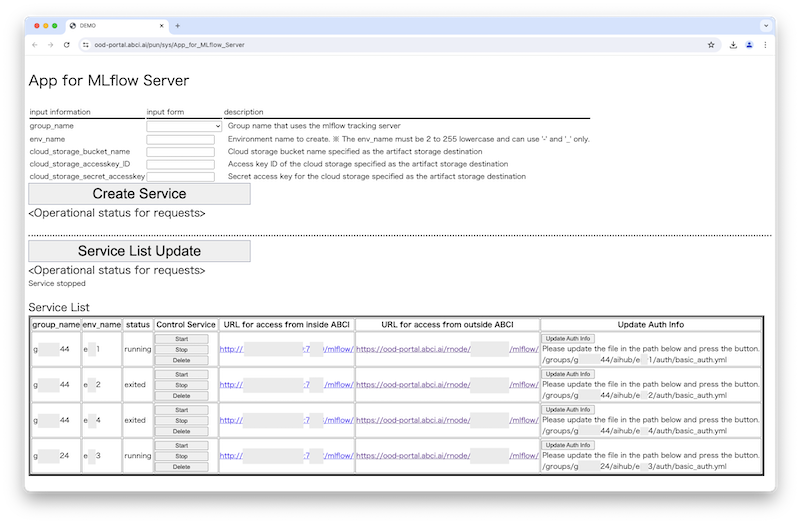

# AIHub

## 概要 {#overview} 

AIHubはABCI上で大規模な汎用学習済みモデルの再利用等を行うためのツールやサービス群であり、Open OnDemandからは`App for MLflow Server`を利用できます。

`App for MLflow Server`は、実験管理ツールである[MLflow](https://mlflow.org/docs/latest/index.html)のTracking ServerをABCIグループ単位で利用できる形にデプロイし、WebUIから管理できるアプリです。

デプロイされたMLflow Tracking Serverは、ABCIの計算ノードやOpen OnDemandのJupyter Labから、モデル開発における学習履歴や学習モデルの記録・共有のためにチームで利用できます。

!!! caution
    `App for MLflow Server`は試験的機能として公開しています。
    予告なくサービス変更する場合や問い合わせへの回答が困難な場合があります。

## 前提条件 {#prerequisite}

* アプリ用コマンド実行許可設定
  * アプリ利用のためにABCIアカウントに管理サーバのコマンド実行許可設定が必要となっています。
  * 設定されていない場合は、`App for MLflow Server`の管理者へ依頼してください。 

## アプリ操作方法 {#operation}

* `App for MLflow Server`を起動すると、以下のような画面が表示されます。

　
* MLflow Tracking Serverを作成(デプロイ)する場合
  * 予めABCIクラウドストレージにバケットとアクセスキーの作成が必要です。
    * 作成方法は[ABCIクラウドストレージの使い方](https://docs.abci.ai/ja/abci-cloudstorage/usage/)をご確認ください。  
  * 画面の説明にもとに、以下の項目を入力し`Create Service`ボタンをクリックします。
    * ABCIグループ名
    * 環境名
    * バケット名
    * アクセスキーID
    * シークレットアクセスキー
  * Serviceの作成に成功すると、Operational status for requestsに「Service created」と表示されます。

* MLflow Tracking Serverを管理・利用する場合
  * `Service List Update`ボタンをクリックする事で、自身が利用可能なService List を一覧表示できます。
  * Control Service のボタンを操作することでサービスの起動、停止、削除を行えます。
    * Operational status for requests に操作の状態が表示されます。
    * 利用を終えたサービスは、資源節約のため停止や削除にご協力ください。
  * MLflow Tracking ServerにBasic認証の設定する場合は、対象サービスの`Update Auth Info`ボタンをクリックします。
    * 予め所定の場所に以下のフォーマットのYAMLファイルを配置しておく必要があります。
      * {'user_name':'<Basic認証用ユーザ名>', 'pass':'<Basic認証用パスワード>'}
  * MLflowのUIを確認する場合は、`URL for access from outside ABCI`のURLをクリックします。
    * Basic認証用のユーザ名とパスワードを入力してログインします。
  * 起動しているMLflow Tracking Serverをご利用ください。
    * ABCIの[ジョブ](https://docs.abci.ai/ja/job-execution/)やOpen OnDemandのJupyter Labから利用できます。
    * MLflow APIのトラッキングURIに`URL for access from inside ABCI`を指定することで、AIモデルの学習履歴や学習モデルをモデルレジストリに記録できます。
    * MLflow Tracking Serverの具体的な利用方法は[MLflow](https://mlflow.org/docs/latest/index.html)のドキュメントをご確認ください。
