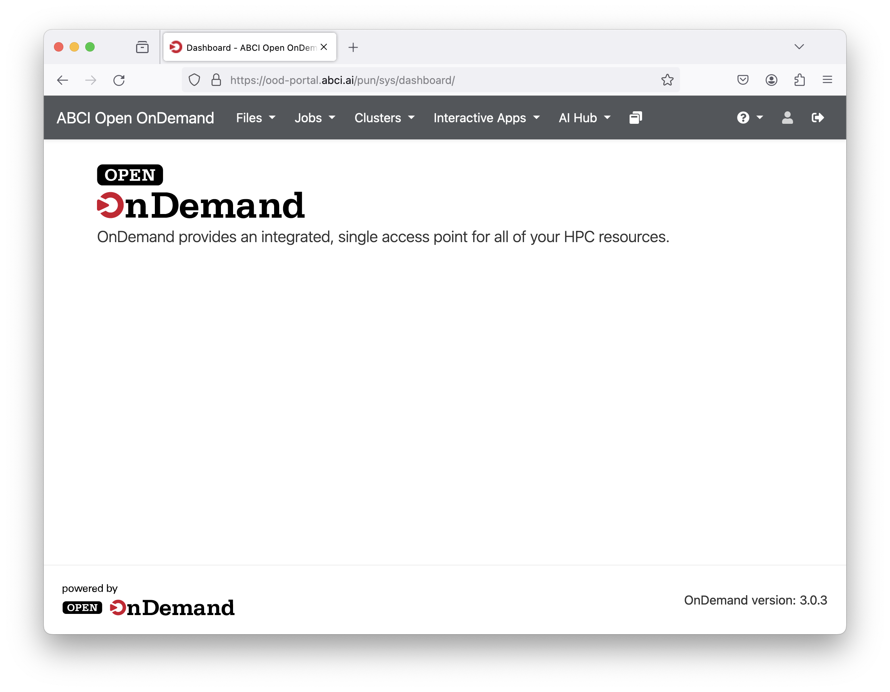
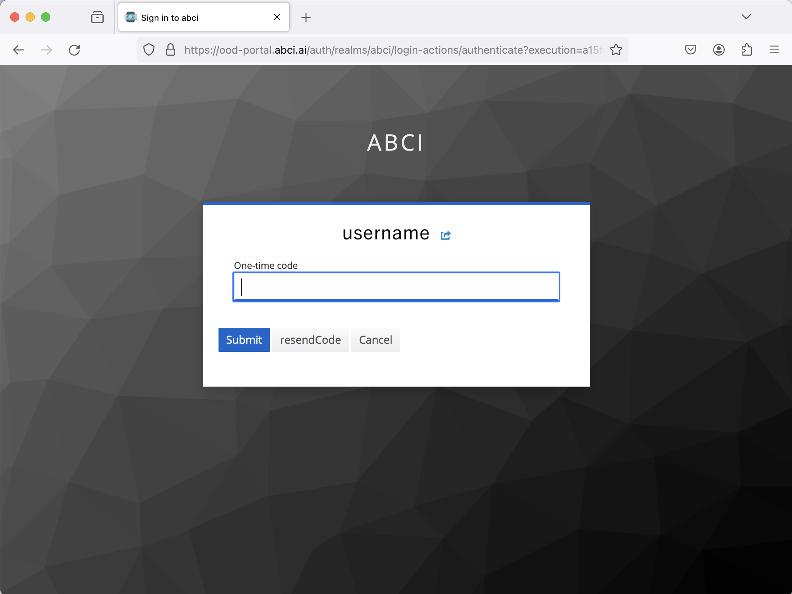
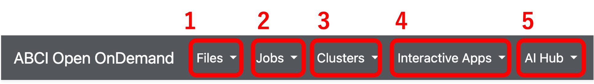

# Open OnDemand

## 概要 {#overview}

[Open OnDemand (OOD)](https://openondemand.org/)はWebブラウザからABCIを使用するためのポータルサイトです。

以下の機能がWebブラウザ上で利用できるようになり、従来より簡単にABCIを使えるようになります。

- インタラクティブノードでのコンソール操作
- ホーム領域、グループ領域のファイル操作
- Jupyter Lab等のWebアプリケーションの利用

{width=640}

!!! caution
    Open OnDemandは試験的機能として公開しています。
    予告なくサービス変更する場合や、問い合わせへの回答に時間を要する場合があります。

## ログイン方法 {#login}

Open OnDemandにログインするためにはまず、URL [https://ood-portal.abci.ai/](https://ood-portal.abci.ai/) にアクセスします。
ood-portal.abci.ai にアクセスした後、ABCIアカウント名とパスワードの入力が求められるので、[ABCI利用者ポータル](https://portal.abci.ai/)で設定したABCIアカウント名とパスワードを入力してください。

[{width=640}](img/login.png)

ABCIアカウント名とパスワードによる認証後、アクセスコードの入力が求められます。
アクセスコードは登録しているメールアドレス宛に送付されますので、アクセスコードを受信後、入力フォームにアクセスコードを入力してください。

[{width=640}](img/email-otp.png)

アクセスコードによる認証後、Open OnDemandへのログインが完了します。

[{width=640}](img/ondemand-top-page.png)

!!! warning
    ログイン中にエラーが発生した場合は、管理者まで[お問合せ](../contact.md)ください。

## アプリケーション {#applications}

Open OnDemandが提供する機能には、画面上部のメニューからアクセスできます。

1. **Files**: ファイル操作をブラウザ上で行えます

2. **Jobs**: ジョブ編集・管理をブラウザ上で行えます

3. **Clusters**: インタラクティブノードのコンソールが開きます

4. **Interactive Apps**: 計算ノード上でWebアプリケーションを起動し、その画面をWebブラウザに転送します。 
   詳細は[インタラクティブアプリ](interactive-apps.md)を参照ください。

5. **AI Hub**: AI HubはABCI上で大規模な汎用学習済みモデルの再利用等を行うためのツールやサービス群です。AI Hubを構成する機能の1つである、Mlflow Tracking Serverのデプロイを管理するアプリケーションを提供します。 
   詳細は[AI Hub](aihub.md)を参照ください。
